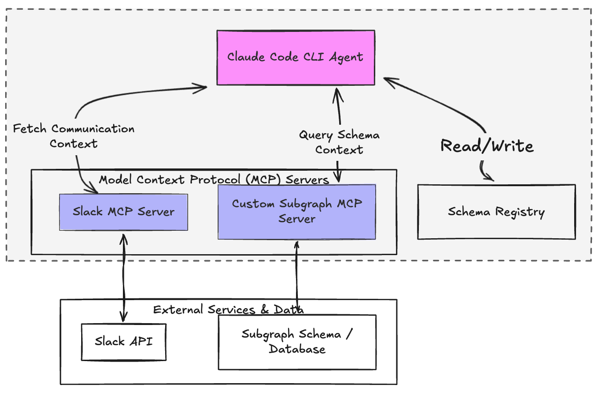

## Problem

Schema review is a high-repetition support process. Engineers open PRs, request design guidance, wait for async feedback, revise, and repeat — often across multiple rounds that lose context between interactions. Reviewers spent significant time re-reading prior Slack threads and PR history just to re-establish context before each response.

There was no system to carry state between stages of a review cycle, which meant every interaction started nearly from scratch.

## High Level

Orchestrated as a Claude Code agent with MCP servers attached, running locally via CLI — Slack MCP for communication context and a custom subgraph MCP for schema context.

Built an AI-driven orchestration system using Claude that structures schema review into three workflow stages, each pulling context from different sources:

- **Standup stage**: Pulls the current review state from Slack via MCP — surfaces active threads, pending feedback, and open items to prepare context for the review pass
- **Review stage**: Fetches PR details via GitHub CLI, then runs Claude against the diff using a structured review workflow — a custom subgraph MCP provides supergraph context (type duplication, schema history) to inform the analysis
- **Sign-off stage**: Evaluates whether outstanding issues from the review have been resolved before closing the loop

Each stage hands its output to the next as structured state, so context is never lost between async interactions.

## Design Decisions

**1. MCP for context retrieval at each stage**  
Rather than manually passing context between stages, each stage uses an MCP server to pull exactly what it needs — Slack MCP for reading thread context, a custom subgraph MCP for supergraph schema context. This kept each stage focused and made the context sources swappable independently.

**2. Structured input/output contracts on LLM calls**  
Each Claude call has a defined input schema and expected output structure. This enforces deterministic behavior across stages — rather than free-form output, each stage produces typed, parseable results the next stage can reliably consume.

**3. Iterative refinement with historical context**  
The system evaluates prior review outputs and reprocesses them using accumulated feedback history. This allowed the review quality to improve across iterations without requiring a human to re-summarize prior context each round.

## Impact

Replaced the manual process of collecting Slack context, reading PR history, and re-establishing review state before each feedback round. Each review pass now starts with full context assembled automatically, saving an estimated 2–3 hours per review cycle and reducing the risk of human error from missing or misremembered context.
